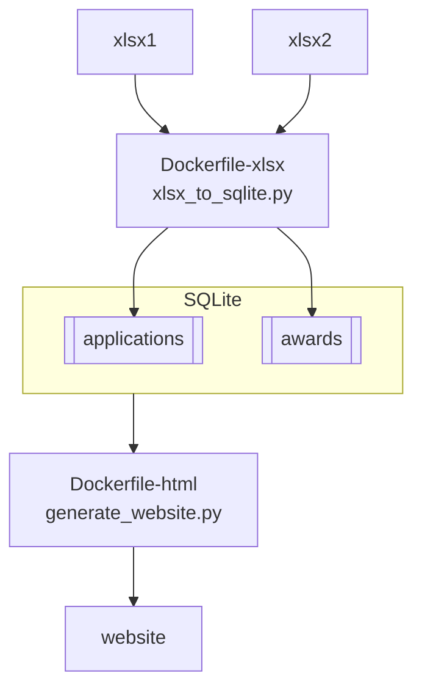

# North & South Omaha Recovery Grant Program (NSORG)

[Official NSORG website](https://opportunity.nebraska.gov/programs/recovery/nsorg/)
of the Nebraska Department of Economic Development.

This repository is additional resources by Open/Nebraska volunteers.
If you discover any errors, or want to request new features, please
[create an Issue](https://github.com/opennebraska/nsorg/issues).

This document intends to document all the recreation steps for running the
analysis we performed, from scratch (.xlsx).

## Overview



## Step 1: Turn .xlsx files into a SQLite database

Python Pandas is convenient for reading and cleaning .xlsx files. 
Locally we have a bunch of Pythons, and Pandas won't install, so let's use Docker:

    docker build . --file Dockerfile-xlsx --tag pandas-xlsx
    docker run -it --mount type=bind,source="$(pwd)",target=/home/data pandas-xlsx

Now we have a SQLite database containing `Grant Application.xlsx`.

```
sqlite3 nsorg.sqlite3

sqlite> .schema applications
CREATE TABLE IF NOT EXISTS "applications" (
"ID" INTEGER,
  "OrgName" TEXT,
  "PhysicalAddress" TEXT,
  "MailingAddress" TEXT,
  "Website" TEXT,
  "SocialMediaAccounts" TEXT,
  "Name" TEXT,
  "Title" TEXT,
  "EmailAddress" TEXT,
  "Phone" TEXT,
  "Team" TEXT,
  "TeamExplanation" TEXT,
  "OrganizationalChart" TEXT,
  "OtherCompletedProjects" TEXT,
  "ProposalTitle" TEXT,
  "TotalBudget" REAL,
  "LB1024GrantFundingRequest" REAL,
  "ProposalType" TEXT,
  "BriefProposalSummary" TEXT,
  "Timeline" TEXT,
  "PercentageCompletedByJuly2025" REAL,
  "FundingGoals" TEXT,
  "Community Needs" TEXT,
  "OtherExplanation" TEXT,
  "ProposalDescriptionAndNeedsAlignment" TEXT,
  "VisioningWorkshopFindingsAlignment" TEXT,
  "PrioritiesAlignment" TEXT,
  "EconomicImpact" TEXT,
  "EconomicImpactPermanentJobsCreated" TEXT,
  "EconomicImpactTemporaryJobsCreated" TEXT,
  "EconomicImpactWageLevels" TEXT,
  "EconomicImpactAlignProposedJobs" TEXT,
  "CommunityBenefit" TEXT,
  "CommunityBenefitSustainability" TEXT,
  "BestPracticesInnovation" TEXT,
  "OutcomeMeasurement" TEXT,
  "OutcomeMeasurementHow" TEXT,
  "OutcomeMeasurementCoinvestment" TEXT,
  "Partnerships" TEXT,
  "PartnershipsOrgs" TEXT,
  "PartnershipsMOU" TEXT,
  "Displacement" TEXT,
  "DisplacementExplanation" TEXT,
  "PhysicalLocation" TEXT,
  "QualifiedCensusTract" TEXT,
  "AdditionalLocationDocuments" TEXT,
  "PropertyZoning" TEXT,
  "ConnectedToUtilities" TEXT,
  "ConnectedToUtilitiesConnected" TEXT,
  "ConnectedToUtilitiesUpgradesNeeded" TEXT,
  "DesignEstimatingBidding" TEXT,
  "DesignEstimatingBiddingPackageDeveloped" TEXT,
  "DesignEstimatingBiddingCostsDetermined" TEXT,
  "GeneralContractor" TEXT,
  "GeneralContractorPublicCompetitiveBid" TEXT,
  "GeneralContractorPublicCompetitiveBidWhyNot" TEXT,
  "RequestRationale" TEXT,
  "GrantFundsUsage" TEXT,
  "ProposalFinancialSustainability" TEXT,
  "ProposalFinancialSustainabilityOperations" TEXT,
  "FundingSources" TEXT,
  "FundingSourcesPendingDecisions" TEXT,
  "FundingSourcesCannotContinue" TEXT,
  "Scalability" TEXT,
  "ScalabilityComponents" TEXT,
  "FinancialCommitment" TEXT,
  "ARPAComplianceAcknowledgment" REAL,
  "ARPAReportingMonitoringProcessAck" REAL,
  "LB1024FundingSourcesAck" REAL,
  "PublicInformation" REAL,
  "FileUploads" TEXT
);
CREATE INDEX "ix_applications_index" ON "applications" ("ID");

sqlite> SELECT count(*) from applications;
369

sqlite> SELECT QualifiedCensusTract, count(*) FROM applications GROUP BY 1;
|21
Adjacent to one or more QCTs|25
Neither within or adjacent to the QCTs|6
Within one or more QCTs|317
```

And our SQLite database contains `NSORG Awards Data.xlsx`:

```
sqlite> .schema awards
CREATE TABLE IF NOT EXISTS "awards" (
"index" INTEGER,
  "Category" TEXT,
  "ProposalName" TEXT,
  "OrganizationName" TEXT,
  "NSORGID" INTEGER,
  "FundingAmount" REAL
);
CREATE INDEX "ix_awards_index"ON "awards" ("index");

sqlite> select sum(FundingAmount) from awards;
274420003.17

sqlite> select Category, sum(FundingAmount) from awards GROUP BY 1;
(blank)|0.0
Arts/Social|19373000.0
E&I|17810972.0
FQHC|20000000.0
HOF Museum|20000000.0
Placemaking|116000000.0
RAPID|13575711.17
Recovery Housing|0.0
SBSG|46027500.0
Sports/Tourism|10950000.0
YTWD|10682820.0
```

## Step 2: ...

## Step 3: Generate website

    docker build . --file Dockerfile-html --tag pandas-html
    docker run -it --mount type=bind,source="$(pwd)",target=/home/data pandas-html

## Dev Notes

ChatGPT 4o prompt:

Reset context.
Use Python Pandas dataframes and Seaborn.
Create a dataframe of 20 Awards of random US Dollar Amounts between $50,000 and $40,000,000.
Categorize those Awards into 3 categories by US Dollar Amount: "< $100,000", "< $20,000,000", and "> $20,000,000".
Generate a Seaside stacked bar chart where the X axis is Category and the Y axis is US Dollars.
Show me that chart.

